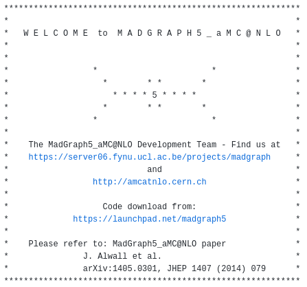
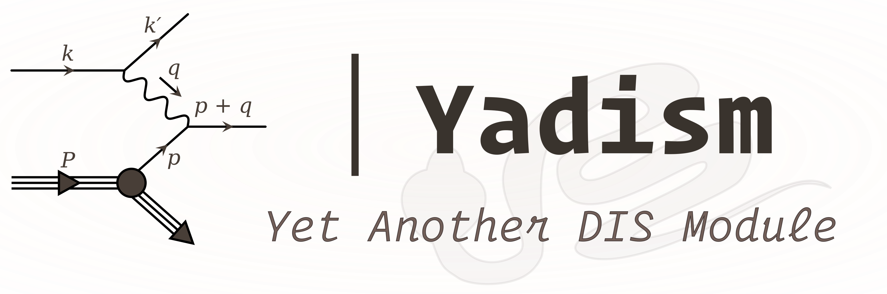

####################################
Welcome to pinefarm's documentation!
####################################

This documentation is about the python package used to generate
|pineappl| grids.
This program is called `pinefarm` (and its CLI ``pinefarm``).

`pinefarm` serves as common interface to several other external programs that
contain the actual physics. We currently support:

- |mg5i| |mg5|
- |yadismi| |yadism|

To run `pinefarm` you need two specify to sets of inputs:

1. a theory runcard, as is used by `nnpdf <https://github.com/NNPDF/nnpdf>`_.
   The theory runcard defines the general parameters of the QCD framework, such as perturbative
   orders, coupling strength or heavy quark masses.
   A list of example theory runcards is also available
   `in the repository <https://github.com/NNPDF/pinefarm/tree/main/extras/theories>`_
2. a pinecard, as is described `here <pinecards/index>`_.
   The pinecard describes the actual measurement that is performed, e.g. observable definitions,
   kinematic bins, or cuts. The pinecard will also determine which external program is executed.
   A list of already available is available at the
   `pinecards repository <https://github.com/NNPDF/pinecards>`_.

Given those two things you can run

.. code-block:: sh

   pinefarm run <PATH_TO_PINECARD> <PATH_TO_THEORYCARD>

and the program will, if necessary, install the required external program and launch it's execution.

.. toctree::
   :maxdepth: 1
   :hidden:
   :caption: Usage

   install
   run
   output
   cli

.. toctree::
   :maxdepth: 1
   :hidden:
   :caption: Pinecards

   pinecards/index
   pinecards/metadata
   pinecards/postrun

.. toctree::
   :maxdepth: 1
   :hidden:
   :caption: Externals

   external/index
   external/mg5
   external/yadism

.. toctree::
   :maxdepth: 1
   :hidden:
   :caption: Implementation

   API <modules/pinefarm/pinefarm>
   indices
